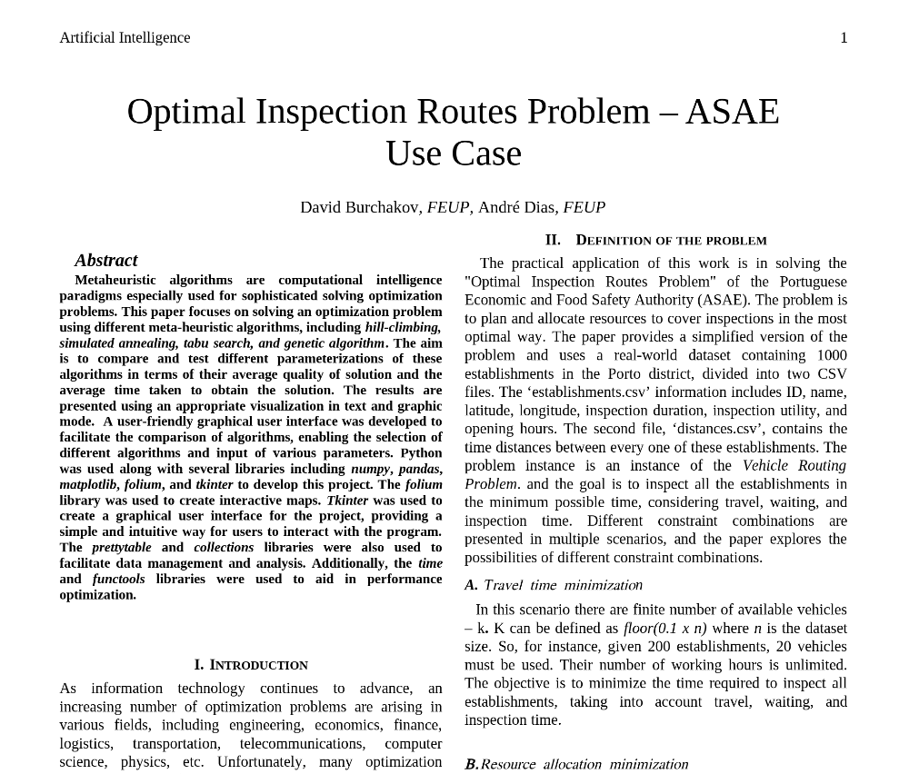

# Optimization Problem - Travelling Salesman Problem 
## Description
The purpose of the project is to learn and apply different optimizations approaches/algorithms for the famous Travelling Salesman (SalesPerson) Problem.
A dataset with 1000 establishments is given, as well as their latitude and longitude location. 

Two scenarios explored.

**For a more detailed description open [report](report_FINAL.pdf)**

## Set-up
Open *AITSP-FINAL.ipynb* file with Jupyter Notebook

# First Scenario - Travel time minimization

* A finite number of available vehicles – k
* k can be defined by (0.1 x n) where n is the dataset size. So, for instance, given 200 establishments, 20 vehicles must be used
* Their number of working hours is unlimited
* The goal is to inspect all the establishments in the minimum possible time, considering travel, waiting and inspection time

# Second Scenatio - Resource allocation minimization

* In this variant there are an infinite number of available vehicles 
* Each ones’ route must not exceed the 8 working hours 
* The vehicles are not required to finish their routes in the departure point, i.e. the route is considered to be finished immediately after the last inspection
* The goal in this problem is to inspect all the establishments using the minimum number of vehicles possible
* The inspection’s duration must be considered 5 minutes 

# Algorithms utilized

* Hill Climbing
* Genetic algorithm
* Simulated Annealing
* Tabu Search
